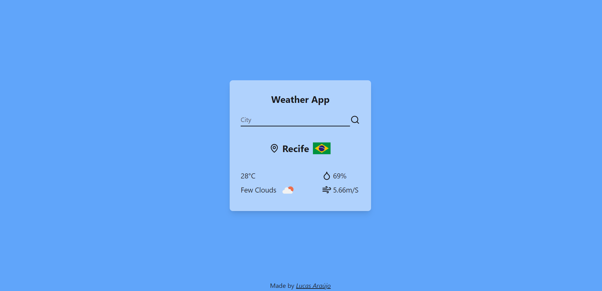

# 🌤️ Weather App

Um aplicativo web de previsão do tempo construído com Next.js, que permite aos usuários obter informações de previsão do tempo para uma determinada cidade.

## ⚙️ Funcionalidades

- 🔍 Pesquisa de cidade: Os usuários podem pesquisar por uma cidade específica para obter a previsão do tempo atual.
- 🌡️ Exibição de informações: A previsão do tempo inclui temperatura, condições climáticas, umidade e velocidade do vento.

## 🛠️ Tecnologias Utilizadas

- Next.js: Framework React para desenvolvimento web.
- TailwindCSS: Framework CSS utilitário para estilização rápida e responsiva.
- Lucide-react: Bliblioteca de ícones.
- API de Previsão do Tempo: Utilizei [OpenWeatherMap](https://openweathermap.org) para obter os dados de previsão do tempo.

## ⚙️ Pré-requisitos

- Node.js (versão 12 ou superior)
- NPM ou Yarn

## ▶️ Como Executar o Projeto

1. Clone este repositório para o seu ambiente local.
2. No terminal, navegue até o diretório do projeto.
3. Instale as dependências usando o comando `npm install` ou `yarn install`.
4. Configure a variável de ambiente da API de previsão do tempo. Crie um arquivo `.env.local` na raiz do projeto e adicione a seguinte linha: `NEXT_PUBLIC_API_TOKEN=SUA_CHAVE_DE_API`.
5. Inicie o servidor de desenvolvimento local com o comando `npm run dev` ou `yarn dev`.
6. Acesse o aplicativo em `http://localhost:3000` no seu navegador.

## 🤝 Contribuição

Contribuições são bem-vindas! Se você encontrar algum problema, tiver alguma sugestão ou desejar adicionar novos recursos, sinta-se à vontade para abrir uma issue ou enviar um pull request.

## 📄 Licença

Este projeto está licenciado sob a Licença MIT. Consulte o arquivo [LICENSE](LICENSE) para obter mais detalhes.
